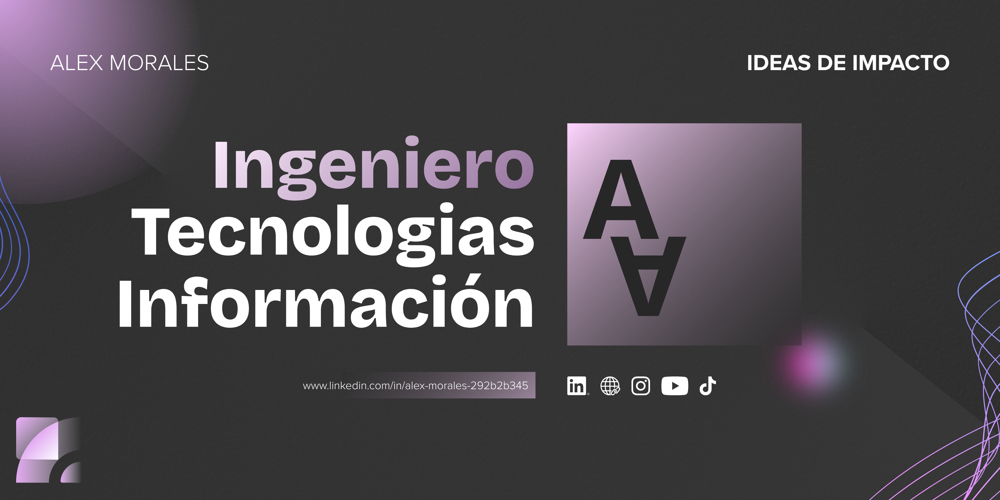
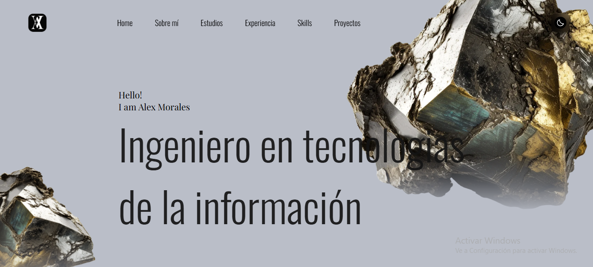
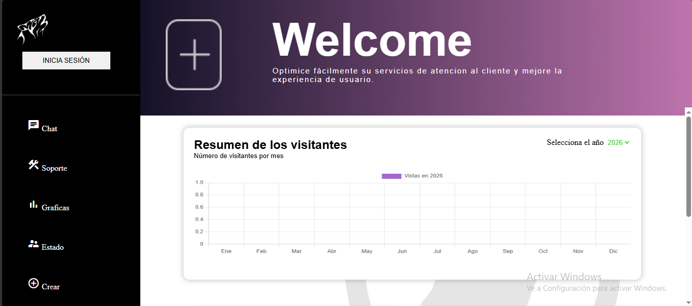

# Hola Mundo, Soy Alex Morales! 👋

## Sobre Mi 🚀

Ingeniero en Tecnologías de la Información con especialización en desarrollo de Software Full Stack. Experiencia en el diseño y desarrollo de aplicaciones web, creando interfaces responsivas y centradas en la experiencia del usuario (UI/UX), así como en el manejo e integración de datos mediante operaciones CRUD. Destaco por mi capacidad de resolución de problemas, trabajo colaborativo y adaptación a nuevas tecnologías. Busco contribuir al desarrollo de soluciones de alto impacto, aportando calidad técnica, aprendizaje continuo y compromiso con los objetivos estratégicos de la organización.

## Mis Herramientas 🧠

*Replace the above skill badges with your own skills and expertise. To create more badges, use [checkout this repo](https://github.com/alexandresanlim/Badges4-README.md-Profile).*

## Proyectos Destacados 💻

### [Portafolio Design](https://alexmorales-dev.github.io/Portafolio)

**[Portafolio Design]** es un proyecto que consiste en un **portafolio web responsivo** diseñado para mostrar mis habilidades en desarrollo y diseño web. En él presento proyectos, tecnologías y conocimientos mediante una interfaz moderna, atractiva y optimizada para distintos dispositivos. Además de demostrar la calidad de mi código, el sitio refleja buenas prácticas de diseño UI/UX, organización del contenido y adaptación a diferentes tamaños de pantalla. Utilizando tecnologias cómo   .

### [Sistema Userkei](https://rafaelgj.org/UserKei/index.php?seccion=graficas)

**UserKei** es un **sistema web de gestión flexible diseñado para ayudar a empresas, negocios, organizaciones y sitios web a administrar sus procesos de manera eficiente** desarrollado con **PHP, MySQL, HTML, CSS, JavaScript, Bootstrap, Chart.js, PHPMailer y FPDF**. Este proyecto demuestra mis habilidades en **desarrollo web Full Stack, operaciones CRUD, gestión de bases de datos, autenticación, diseño de interfaces, visualización de datos, generación de archivos PDF e integración de servicios de correo electrónico**. Puedes consultar el repositorio [aquí](project_2_repository_link).

## Contacto 📬

  
